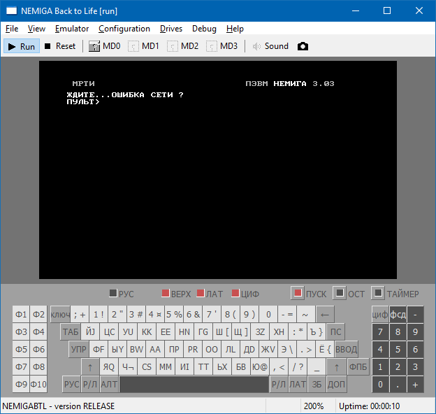

# nemigabtl
**Nemiga Back to Life!** is emulator of **NEMIGA PK 588**, soviet computer based on PDP-11 compatible processor.

#### In Russian / На русском
**Немига ПК 588** – советский 16-разрядный персональный компьютер,
разработан в Минском радиотехническом институте (МРТИ),
выпускался на белорусских предприятиях с 1989 года.
Предназначался для поставки в учебные заведения в составе учебных вычислительных комплексов.
Построен на комплекте микросхем 588 серии.
По системе команд совместим с Электроника-60, ДВК, т.е. повторяет систему команд DEC PDP-11.

* В Википедии: [Немига (компьютер)](https://ru.wikipedia.org/wiki/%D0%9D%D0%B5%D0%BC%D0%B8%D0%B3%D0%B0_(%D0%BA%D0%BE%D0%BC%D0%BF%D1%8C%D1%8E%D1%82%D0%B5%D1%80))
* На Emuverse: [Немига](http://www.emuverse.ru/wiki/%D0%9D%D0%B5%D0%BC%D0%B8%D0%B3%D0%B0) – технические подробности
  * [Немига/ТО](http://www.emuverse.ru/wiki/%D0%9D%D0%B5%D0%BC%D0%B8%D0%B3%D0%B0/%D0%A2%D0%9E) – техническое описание

Дизассемблированные прошивки Немиги:
* [3.03](https://github.com/nzeemin/nemigabtl/blob/master/docs/nemiga-303.lst)
* [4.05](https://github.com/nzeemin/nemigabtl/blob/master/docs/nemiga-405.lst)
* [4.06](https://github.com/nzeemin/nemigabtl/blob/master/docs/nemiga-406.lst)

##### See Also

* [**nemigabtl-testbench**](https://github.com/nzeemin/nemigabtl-testbench) – NemigaBTL emulator test bench.
* [**nemiga-loderunner**](https://github.com/nzeemin/nemiga-loderunner) – Lode Runner game ported from BK-0010 to Nemiga.
